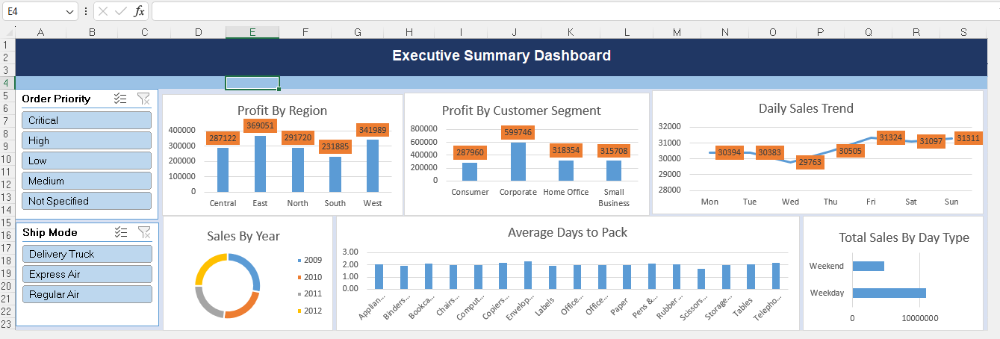

# Excel Sales Analysis Dashboard

## Project Overview

An Excel-based sales analysis and dashboard project focused on analysing:

* Sales
* Profit
* Order Quantity
* Customer Segments
* Regional Performance
* Yearly Trends
* Order Processing Time

The workbook uses **Pivot Tables, Pivot Charts, calculated columns, and an Executive Summary Dashboard** to summarize the data and present business insights.
## Project Features

- Analysed 8,400 sales records using Microsoft Excel
- Created calculated columns for analysis
- Used Pivot Tables to summarize business data
- Created Pivot Charts for data visualization
- Analysed regional and customer segment profitability
- Analysed yearly sales trends
- Compared weekday and weekend sales
- Analysed order quantity by day of the week
- Analyzed average Days to Pack by product sub-category
- Created an Executive Summary Dashboard
## Dataset

The `Sales_Data` sheet contains **8,400 sales records and 27 fields**.

### Key Fields

* Order ID
* Order Date
* Order Quantity
* Sales
* Discount
* Shipping Cost
* Profit
* Ship Mode
* Customer Name
* Province
* Region
* Customer Segment
* Product Category
* Product Sub-Category
* Product Name
* Ship Date
* Day Name
* Year
* Days to Pack
* Day Type

The workbook also includes **Orders** and **Other Info** supporting sheets.

## Analysis

### 1. Regional Profit

Profit was compared across:

* Central
* East
* North
* South
* West

**Key Insight:**
The **East region** recorded the highest profit at approximately **369,051**.

### 2. Customer Segment Profit

Profit was analyzed across:

* Consumer
* Corporate
* Home Office
* Small Business

**Key Insight:**
The **Corporate segment** recorded the highest profit at approximately **599,746**.

### 3. Yearly Sales

| Year |        Sales |
| ---- | -----------: |
| 2009 | 4,383,579.75 |
| 2010 | 3,713,241.37 |
| 2011 | 3,622,409.25 |
| 2012 | 3,895,775.62 |

**Total Sales:** Approximately **15.62 million**

### 4. Day-of-Week Order Quantity

Order quantity was analyzed across all days of the week to identify differences in order activity.

**Total Order Quantity:** **214,777 units**

### 5. Weekday vs Weekend Sales

Sales were compared between weekday and weekend orders.

| Day Type |         Sales |
| -------- | ------------: |
| Weekday  | 10,917,700.42 |
| Weekend  |  4,697,305.57 |

**Key Insight:**
Weekday sales were higher than weekend sales in the dataset.

### 6. Days to Pack

Average Days to Pack was analyzed across product sub-categories.

**Overall Average Days to Pack:** Approximately **2.03 days**

## Dashboard

The workbook contains an **Executive Summary Dashboard** presenting the main analysis and visualizations.

## Pivot Tables

The analysis was supported by Pivot Tables covering:

* Regional Profit
* Customer Segment Profit
* Order Quantity by Day
* Yearly Sales
* Average Days to Pack
* Weekday vs Weekend Sales

## Pivot Charts

Pivot Charts were used to visualize the summarized data and support comparison across different business dimensions.

## Tools and Techniques

* Microsoft Excel
* Data Cleaning
* Pivot Tables
* Pivot Charts
* Dashboard Development
* Data Visualization
* Business-Oriented Analysis

## Key Skills Demonstrated

* Data Cleaning
* Pivot-Based Analysis
* Data Visualization
* Dashboard Creation
* Business Insight Generation
## Dashboard Preview

